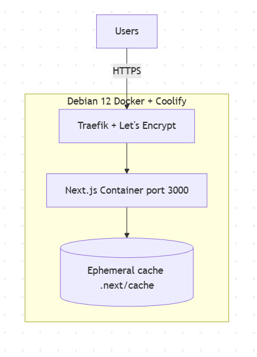

## Gallery App (Next.js)

โปรเจกต์ตัวอย่างแกลเลอรีภาพด้วย Next.js 15 (App Router) + Tailwind + TanStack Query

### 1) เริ่มต้นใช้งาน

```bash
npm i
npm run dev
# http://localhost:3000
```

ไฟล์หลักที่เกี่ยวข้อง

- `src/components/Gallery.tsx` กริดแบบ Masonry + infinite scroll
- `src/components/ImageCard.tsx` วัดความสูงจริงของการ์ดด้วย ResizeObserver
- `src/providers/QueryProvider.tsx` ตั้งค่า TanStack Query (staleTime / gcTime)

---

สรุปสถาปัตยกรรมบน Production (ใช้ Coolify)

- Server specifications
  - 2 vCPU / 4 GB RAM / 40 GB SSD
  - OS: Debian 12 (kernel 6.1.x) x86_64
- Software/Stack
  - Docker + Coolify (มี Reverse Proxy = Traefik + Let’s Encrypt TLS)
  - Next.js App (port 3000) รันเป็น container
- Deploy : Coolify Application
  - Source = GitHub App, Branch = `main`
  - Build Pack = Nixpacks, Build = `npm ci && npm run build`, Start = `npm run start`
  - เปิด Auto‑deploy on push

Diagram: Production



Diagram: CI/CD (Auto‑deploy)


---

```bash
# Dev
npm run dev

# Build/Start Production (local)
npm run build
npm run start
```
